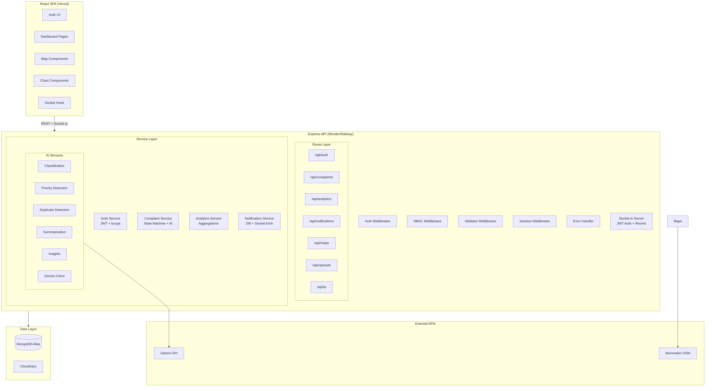
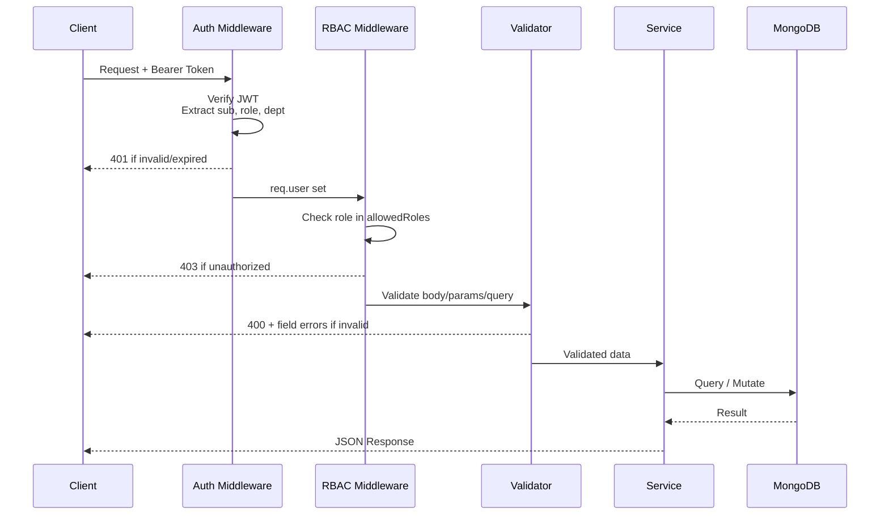
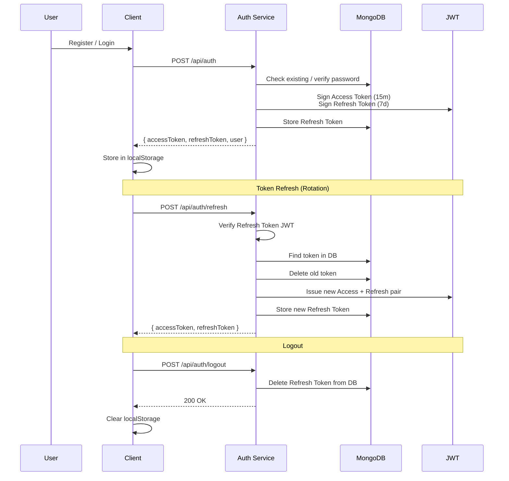
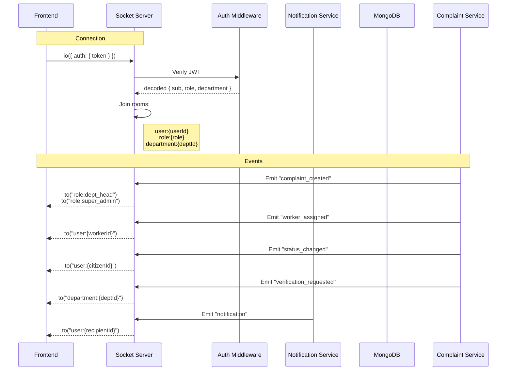
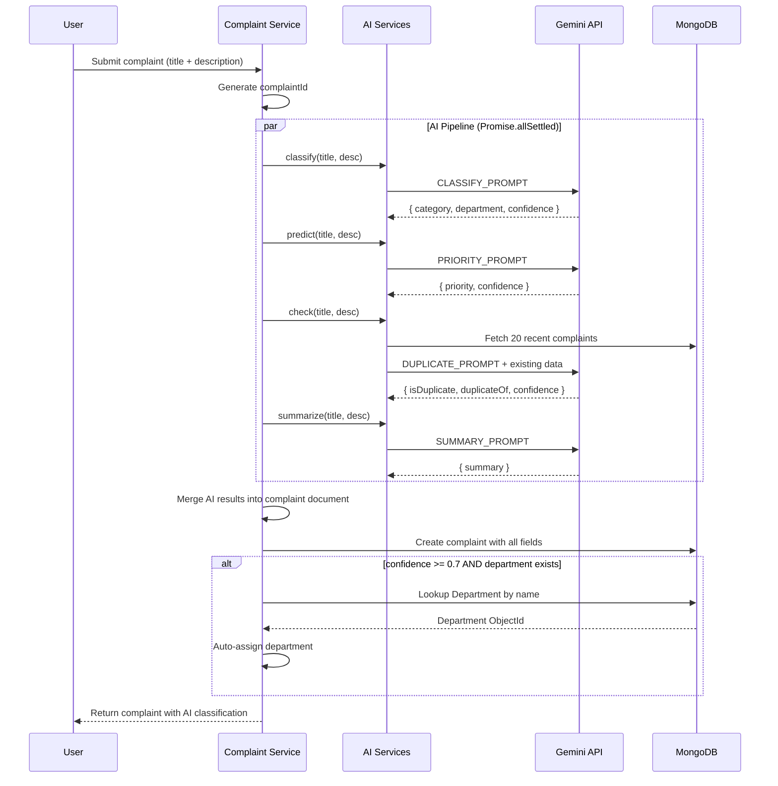
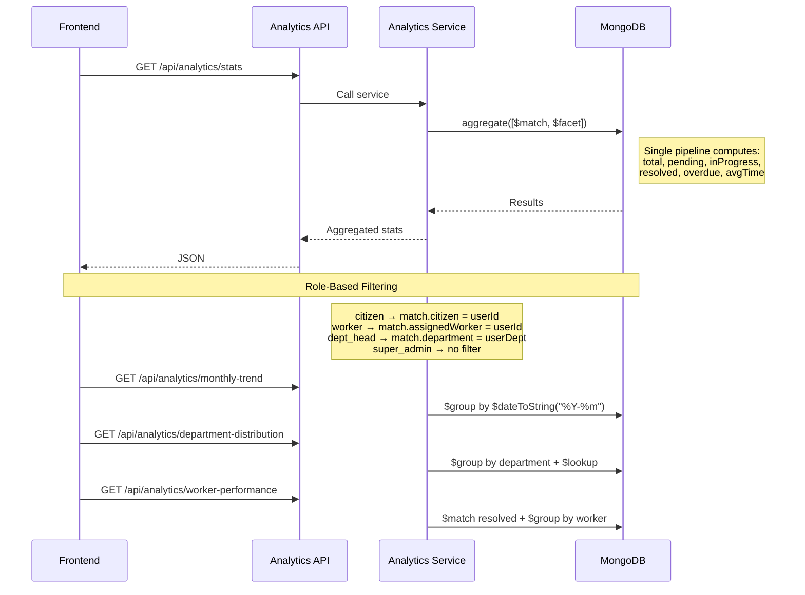

# Architecture

## High-Level Architecture

```mermaid
graph TB
    subgraph Client["React SPA (Vercel)"]
        A1[Auth UI]
        A2[Dashboard Pages]
        A3[Map Components]
        A4[Chart Components]
        A5[Socket Hook]
    end

    subgraph Server["Express API (Render/Railway)"]
        B1[Auth Middleware]
        B2[RBAC Middleware]
        B3[Validator Middleware]
        B4[Sanitize Middleware]
        B5[Error Handler]

        subgraph Routes["Route Layer"]
            C1["/api/auth"]
            C2["/api/complaints"]
            C3["/api/analytics"]
            C4["/api/notifications"]
            C5["/api/maps"]
            C6["/api/uploads"]
            C7["/api/ai"]
        end

        subgraph Services["Service Layer"]
            D1[Auth Service<br/>JWT + bcrypt]
            D2[Complaint Service<br/>State Machine + AI]
            D3[Analytics Service<br/>Aggregations]
            D4[Notification Service<br/>DB + Socket Emit]

            subgraph AI["AI Services"]
                E1[Classification]
                E2[Priority Detection]
                E3[Duplicate Detection]
                E4[Summarization]
                E5[Insights]
                E6[Gemini Client]
            end
        end

        F1[Socket.io Server<br/>JWT Auth + Rooms]
    end

    subgraph Data["Data Layer"]
        G1[(MongoDB Atlas)]
        G2[Cloudinary]
    end

    subgraph External["External APIs"]
        H1[Gemini API]
        H2[Nominatim OSM]
    end

    Client -- REST + Socket.io --> Server
    Server --> Data
    AI --> H1
    Maps --> H2
```

## Request Flow

```mermaid
sequenceDiagram
    participant C as Client
    participant A as Auth Middleware
    participant R as RBAC Middleware
    participant V as Validator
    participant S as Service
    participant M as MongoDB

    C->>A: Request + Bearer Token
    A->>A: Verify JWT<br/>Extract sub, role, dept
    A-->>C: 401 if invalid/expired

    A->>R: req.user set
    R->>R: Check role in allowedRoles
    R-->>C: 403 if unauthorized

    R->>V: Validate body/params/query
    V-->>C: 400 + field errors if invalid

    V->>S: Validated data
    S->>M: Query / Mutate
    M-->>S: Result
    S-->>C: JSON Response
```

## Authentication Flow

```mermaid
sequenceDiagram
    participant U as User
    participant C as Client
    participant A as Auth Service
    participant M as MongoDB
    participant J as JWT

    U->>C: Register / Login
    C->>A: POST /api/auth
    A->>M: Check existing / verify password
    A->>J: Sign Access Token (15m)<br/>Sign Refresh Token (7d)
    A->>M: Store Refresh Token
    A-->>C: { accessToken, refreshToken, user }
    C->>C: Store in localStorage

    Note over C,J: Token Refresh (Rotation)
    C->>A: POST /api/auth/refresh
    A->>A: Verify Refresh Token JWT
    A->>M: Find token in DB
    A->>M: Delete old token
    A->>J: Issue new Access + Refresh pair
    A->>M: Store new Refresh Token
    A-->>C: { accessToken, refreshToken }

    Note over C,J: Logout
    C->>A: POST /api/auth/logout
    A->>M: Delete Refresh Token from DB
    A-->>C: 200 OK
    C->>C: Clear localStorage
```

## Socket.io Flow

```mermaid
sequenceDiagram
    participant F as Frontend
    participant S as Socket Server
    participant A as Auth Middleware
    participant N as Notification Service
    participant M as MongoDB
    participant CS as Complaint Service

    Note over F,S: Connection
    F->>S: io({ auth: { token } })
    S->>A: Verify JWT
    A-->>S: decoded { sub, role, department }
    S->>S: Join rooms:
    Note right of S: user:{userId}<br/>role:{role}<br/>department:{deptId}

    Note over F,CS: Events
    CS->>S: Emit "complaint_created"
    S-->>F: to("role:dept_head")<br/>to("role:super_admin")

    CS->>S: Emit "worker_assigned"
    S-->>F: to("user:{workerId}")

    CS->>S: Emit "status_changed"
    S-->>F: to("user:{citizenId}")

    CS->>S: Emit "verification_requested"
    S-->>F: to("department:{deptId}")

    N->>S: Emit "notification"
    S-->>F: to("user:{recipientId}")
```

## AI Pipeline Flow

```mermaid
sequenceDiagram
    participant U as User
    participant C as Complaint Service
    participant AI as AI Services
    participant G as Gemini API
    participant M as MongoDB

    U->>C: Submit complaint (title + description)
    C->>C: Generate complaintId

    par AI Pipeline (Promise.allSettled)
        C->>AI: classify(title, desc)
        AI->>G: CLASSIFY_PROMPT
        G-->>AI: { category, department, confidence }

        C->>AI: predict(title, desc)
        AI->>G: PRIORITY_PROMPT
        G-->>AI: { priority, confidence }

        C->>AI: check(title, desc)
        AI->>M: Fetch 20 recent complaints
        AI->>G: DUPLICATE_PROMPT + existing data
        G-->>AI: { isDuplicate, duplicateOf, confidence }

        C->>AI: summarize(title, desc)
        AI->>G: SUMMARY_PROMPT
        G-->>AI: { summary }
    end

    C->>C: Merge AI results into complaint document
    C->>M: Create complaint with all fields

    alt confidence >= 0.7 AND department exists
        C->>M: Lookup Department by name
        M-->>C: Department ObjectId
        C->>C: Auto-assign department
    end

    C-->>U: Return complaint with AI classification
```

## Analytics Flow

```mermaid
sequenceDiagram
    participant F as Frontend
    participant A as Analytics API
    participant S as Analytics Service
    participant M as MongoDB

    F->>A: GET /api/analytics/stats
    A->>S: Call service
    S->>M: aggregate([$match, $facet])
    Note right of M: Single pipeline computes:<br/>total, pending, inProgress,<br/>resolved, overdue, avgTime
    M-->>S: Results
    S-->>A: Aggregated stats
    A-->>F: JSON

    Note over F,M: Role-Based Filtering
    Note over S: citizen → match.citizen = userId<br/>worker → match.assignedWorker = userId<br/>dept_head → match.department = userDept<br/>super_admin → no filter

    F->>A: GET /api/analytics/monthly-trend
    S->>M: $group by $dateToString("%Y-%m")

    F->>A: GET /api/analytics/department-distribution
    S->>M: $group by department + $lookup

    F->>A: GET /api/analytics/worker-performance
    S->>M: $match resolved + $group by worker
```

[Back to README](../README.md)
